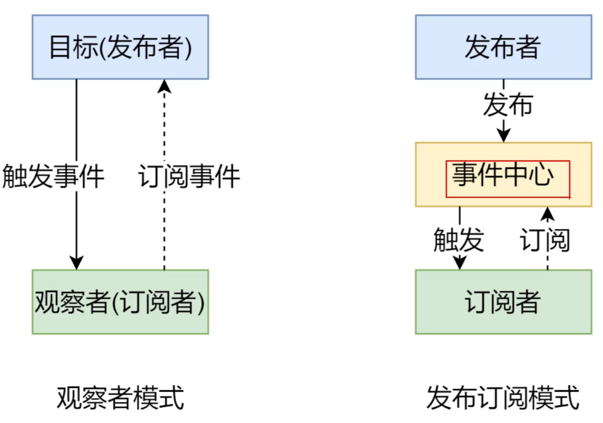

# vue 响应式原理

## 数据驱动

- 数据响应式：修改数据时，dom 自动更新。
- 双向绑定(v-model)：数据改变时，视图改变。视图改变时，数据也随之改变。

## 响应式核心原理

### Vue2.x

Vue2.x 响应式是通过 Object.defineProperty 实现的。

- Object.defineProperty 无法 shim, ie8 及以下不支持。
  - enumerable 默认为 false, 可枚举(是否可遍历)
  - configurable 默认为 false, 可配置(是否可 delete 删除，和使用 defineProperty 重新定义)
  - get 默认为 undefined
  - set 默认为 undefined
  - writable 默认为 false
  - value 默认为 undefined

### Vue3.x

Vue3.x 中响应式原理是通过 Proxy 实现的。

- 它是直接监听对象，而不是某个属性
- 性能比 defineProperty 要好, 写法更简洁
- 可以代理很多属性：get、set、defineProperty 等

### 实现 reactive

步骤:

1. 实现 reactive effect, 存在的问题:

- effect 每次都执行, 需要依赖搜集

2. 如何依赖搜集, handlers 的数据结构是怎么样?
3. 对于属性值为对象的处理? 也要 reactive 化, 问题是

- 如果 return reactive() , 那么每次返回的对象不同, 在依赖搜集时会有问题
- 需要 reactivies 缓存，每次返回同一个对象, vue 里针对同一个对象 reactive 返回值是相等的

## 发布订阅模式和观察者模式

### 发布订阅模式

- 发布者：不知道订阅者的存在, 由消息中心管理
- 订阅者
- 消息中心

Vue 自定义事件

- $on(name, fn)
- $emit(name, data)

### 观察者模式

- 没有事件中心
- 观察者(订阅者)Wather: 有个 update 方法
- 目标(发布者) - Dep, 发布者知道订阅者的存在
  - subs: 存储所有订阅者
  - notify: 调用所有观察者的 update 方法
  - addSub

## 模拟响应式原理
